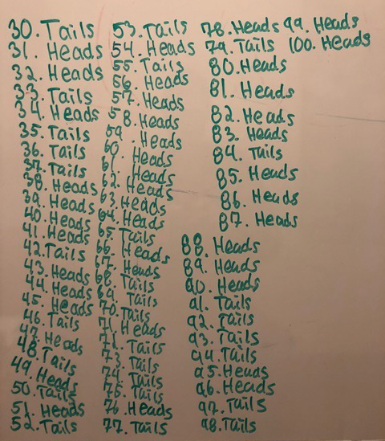
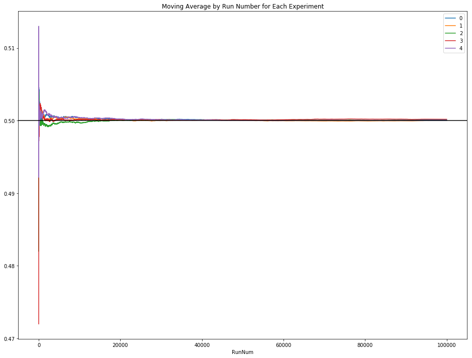
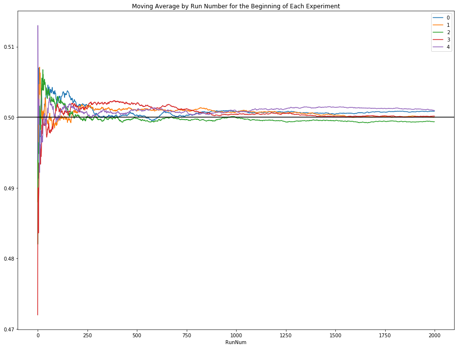

If you extremely impatient: you can see how it converges and interact with the graphic, check out the interactive [Bokeh](https://bokeh.pydata.org/en/latest/) plot [here](https://jivjgfjzkf.github.io/experimentCoinToss/).


# Experiment with a Fair Coin Toss
This Jupyter notebook was designed from a fairly simple question from one of my children.  On a Saturday evening, we had learned that Alexa has a feature that allows you to ask for the results of a coin toss.

For example, "Alexa, please flip a coin".

This is neat.  However, the next question from my oldest child was essentially "what would happen if we asked Alexa 100 times to flip a coin?"  That is an excellent question to learn about probability, the [law of large numbers](https://en.wikipedia.org/wiki/Law_of_large_numbers), and chance.

So, I encouraged both of the children to run a small experiment, whereby they asked Alexa 100 times the results of a coin flip.  They diligently recorded their results and provided some excellent documentation.  Asking Alexa to perform this operation was slightly tedious and time consuming.  This is something a computer can perform very efficiently.

<p align="center"></p>

Since both of the children have seen Python, I opted to develop a small function to perform a specified number of coin flips and report the results as the percentage of heads of the total number of flips.  As a result, one could now perform an arbitrary number of coin flips.

```python
#This would call the coinToss function and reques the percentage of heads for 100 coin flips.
coinToss(100)
```

Initially, I setup a single experiment to perform *numTosses*=500 (coin flips) by calling *coinToss*, which was setup to run *n*=100,000 times.  This provided 100,000 samples of 500 coin tosses, or 50,000,000 coin tosses.  Computing the mean on this run resulted in a probability of heads being 50.002216% - this number will be seen again, as a random seed is set on the notebook.

While it is interesting to see the overall mean for a single run, it would be more interesting to (1) watch how the set of 500 coin flips converge to the expected probability of 50% and (2) see how multiple experiments all converge to 50%, consistently.  To do this, a small set of incremental builds were setup.

## Moving Average (Start)
Initially a function to compute the moving average was developed on a small sample set - *numTosses*=1000 and *n*=1.  This was eventually called *calculateMovingAverage*.  However, it was observed that the compute time for this function was expontentially related to the *numTosses* - as *numTosses* increased, the run time increased exponentially.  Algorithmically, there is a very good reason.

## Experimental Setup
The second task was to show how multiple experiments converge to the expected outcome.  To perform this, the whole setup of 100,000 samples of 500 coin tosses was repeated 5 times.  This was fairly straightforward to functionalize with *runExperiment*.

## Moving Average (End)
Scaling up, it was observed that there was a serious issue with the *calculateMovingAverage* function.  In particular, I realized it was grossly inefficient.  The original function was calculating the moving average by running through all *n* items in the vector and calculating the average from *index=0* to every *n* elements.  This made it *O(n^2)* in runtime.  Since the mean is comprised of every element summed together and divided by the total number of elements, if we know our position in the vector and the average, the sum of the elements can be easily computed.  Hence, it is unnecessary to compute the sum at each step.  Rather, the only necessary step at position *i* within an *n* element vector, whereby *n>i*, is to take the mean at *i-1* multiplied by *i*, added to the element at position *i*, and then divided by *i+1*.  The only fencepost condition to handle is the mean at position 0, which is the same as the value at position 0.  Overall, this brought the runtime down from 4 hours and 54 minutes on a vector of 100,000 elements to 93.6 milliseconds - that is a 314,000% improvement in runtime.

Once all of these pieces were in place, it is possible to compute the moving average, quickly, for all five experimental runs and produce a graph that shows the convergence of each experiment to 50%.



If it is difficult to see how chaotic the experiment is in the beginning, below is a graph showing only the first 2,000 runs.



If you would like to see how it converges and interact with the graphic, check out the interactive [Bokeh](https://bokeh.pydata.org/en/latest/) plot [here](https://jivjgfjzkf.github.io/experimentCoinToss/).
